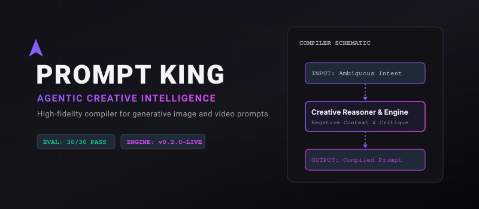
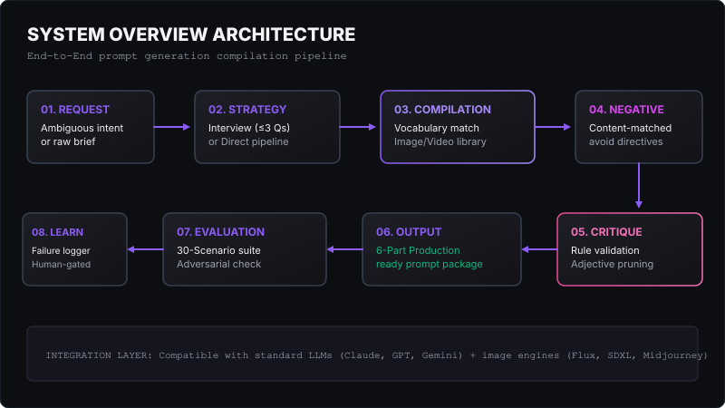
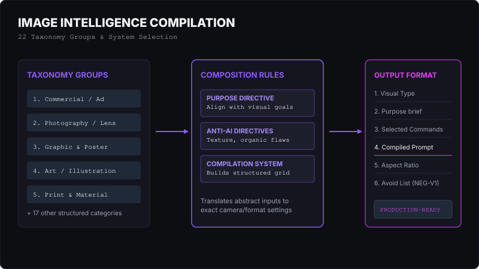
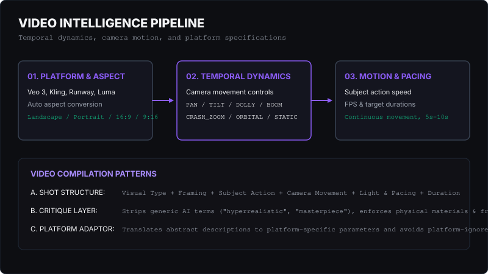
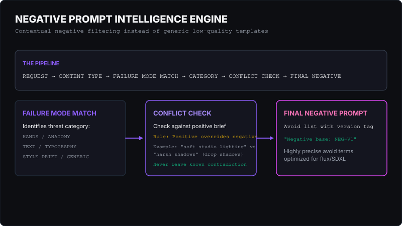
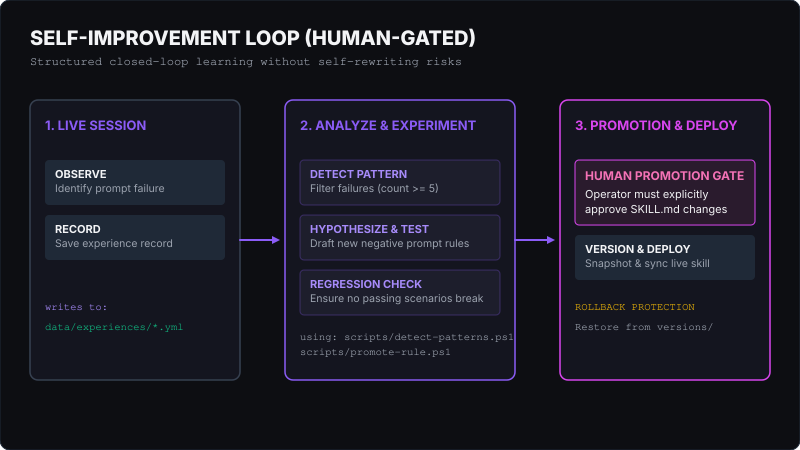
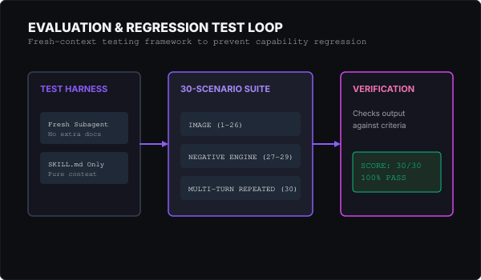

# Prompt King

<p align="center">
  
</p>

<p align="center">
  <a href="https://github.com/tejanaik24/prompt-king/releases"></a>
  <a href="LICENSE"></a>
  
  
</p>

---

Prompt King is a **structured creative intelligence skill** and prompt-compilation framework that transforms raw, ambiguous user inputs into fully-researched, visually-reasoned, and optimized image/video generation prompts. It implements a formal image/video command taxonomy, a contextual negative prompt engine, and a human-gated self-improvement pipeline.

Prompt King works out-of-the-box as a **custom skill in Claude Code** or as a **tool-agnostic system prompt** for any large language model (LLM).

---

## Quick Navigation

*   [What is Prompt King?](#what-is-prompt-king)
*   [Why Prompt King? (The Problem)](#why-prompt-king)
*   [The Core Idea: Commands ≠ Templates](#the-core-idea)
*   [How It Works (System Architecture)](#how-it-works)
*   [Image Intelligence](#image-intelligence)
*   [Video Intelligence](#video-intelligence)
*   [Negative Prompt Intelligence](#negative-prompt-intelligence)
*   [Self-Improvement Loop](#self-improvement)
*   [Safety &amp; Guardrails](#safety--guardrails)
*   [Evaluation &amp; Tests](#evaluation)
*   [Before / After Example](#example)
*   [Installation &amp; Usage](#installation--usage)
*   [Repository Structure](#repository-structure)
*   [Contributing &amp; License](#contributing)

---

## What Is Prompt King?

Prompt King is **not a prompt library**. Instead of providing static, copy-paste templates, it serves as a **compiler** that:
1.  **Extracts creative intent** and fills in missing context using a strict ≤3 question diagnostic interview.
2.  **Performs targeted platform research** when specific video generators or trending styles are requested.
3.  **Applies a structured visual taxonomy** mapping your concept to correct shot sizes, camera models, lighting grids, and physical material responses.
4.  **Generates contextual negative prompts** matched strictly to target failure modes and checked for conflicts against positive parameters.
5.  **Performs self-critique and adjective-stripping** to eliminate generic AI buzzwords ("photorealistic", "masterpiece") in favor of measurable physical instructions.

---

## Why Prompt King?

### The Problem
Naive prompt generators fail because they rely on decorative adjective stacking. Telling an AI model that an image is *"hyperrealistic, stunning, 8k, masterpiece"* does not guide the generator's geometry or light mapping. Instead, it triggers generic AI stock-photo patterns, leading to plastic skin textures, oversaturated gradients, and anatomical deformities.

Furthermore, negative prompts are frequently treated as a "dumping ground" for generic terms (`ugly, deformed, bad hands`), which fight against the positive brief and confuse modern diffusion models.

### The Solution
Prompt King compiles prompts by describing **physical properties, lens physics, camera movements, and lighting structures**. It enforces a strict **anti-generic directive** that replaces visual bloat with concrete guidelines (e.g., swapping "hyperrealistic skin" with "natural skin texture showing pores and fine imperfections").

---

## The Core Idea

### COMMANDS ≠ PROMPT TEMPLATES

*   **Prompt Templates** are fill-in-the-blank sentences. They are rigid, fail when user requirements shift, and lack underlying reasoning.
*   **Commands** are compiled modular units representing visual vocabulary. Prompt King chooses from over **340+ named image and video commands** and synthesizes them dynamically based on the target medium and layout.

---

## How It Works

Prompt King compiles your request through a structured, multi-stage processing pipeline:

<p align="center">
  
</p>

1.  **Intent Classification**: Identifies if the target deliverable is an image, video, or research query.
2.  **Diagnostic Interview**: Triggers a ≤3 question interactive loop if requirements are too ambiguous to resolve, or proceeds via the **Direct Path** if context is sufficient.
3.  **Platform Research**: Searches the web for verified parameters (durations, aspect ratios, model quirks) if a specific generation platform (e.g. Veo 3, Kling) is named.
4.  **Taxonomy Integration**: Assemblies compatible visual commands across camera, lens, lighting, materials, and composition.
5.  **Negative Prompt Engine**: Filters versioned failure modes and executes a conflict check.
6.  **Self-Critique Loop**: Prunes vague intensifiers, verifies typography accuracy, and enforces organic realism constraints before final output.

---

## Image Intelligence

The framework exposes a library of **22 taxonomy groups** covering all professional creative media. Rather than dumping raw commands, the system maps concepts to specific reference guides:

<p align="center">
  
</p>

*   **Commercial &amp; Ad**: Optimized layouts for e-commerce, lifestyle setups, and product heroes.
*   **Photography**: Physical lens specs (35mm, 85mm, prime), camera heights, apertures (f/2.8, f/8), and lighting rigs (chiaroscuro, studio softbox).
*   **Graphic &amp; Editorial**: Swiss typography grids, poster designs, book covers, and collage art.
*   **Material Realism**: Specifying canvas weaves, matte paper grains, and concrete textures to force physical light interaction.

*For a full index of command mappings, see [reference/image-commands.md](reference/image-commands.md).*

---

## Video Intelligence

Video compilation requires temporal controls. Prompt King tracks frame pacing, action speeds, and motion trajectories:

<p align="center">
  
</p>

*   **Camera Movements**: Formal cinematic pans, dollies, tilts, boom moves, and orbital tracking.
*   **Motion Speeds**: Slow-motion pacing, high-speed freezing, and continuous motion continuity.
*   **Adaptors**: Platform cheatsheets containing updated specifications for Veo 3, Kling, Runway, Pika, and Luma.

*For detail on video command mappings, see [reference/video-commands.md](reference/video-commands.md) and [reference/platform-cheatsheets.md](reference/platform-cheatsheets.md).*

---

## Negative Prompt Intelligence

Generic negative prompts confuse modern models. The **Negative Prompt Intelligence Engine** builds a precise, content-type-matched avoid list:

<p align="center">
  
</p>

### The Conflict Check
Before finalizing, Prompt King runs a **Conflict Check** between positive and negative terms. If a negative directly fights a positive instruction (e.g., positive says "soft studio lighting" and negative says "harsh shadows"), the engine resolves it (dropping the negative) to ensure the prompt contains zero internal contradictions, unless the user explicitly overrides it.

*For reference information on the negative engine, see [reference/negative-prompt-engine.md](reference/negative-prompt-engine.md) and [docs/negative-prompt-engine.md](docs/negative-prompt-engine.md).*

---

## Self-Improvement

Prompt King implements a **controlled, human-gated self-improvement system**. It captures failures and learns from them across sessions without the risk of recursive self-corruption:

<p align="center">
  
</p>

### The Learning Loop
1.  **Observe &amp; Record**: At session close, if a prompt failed (e.g. hand deformity), Prompt King records an experience file under `data/experiences/`.
2.  **Pattern Detection**: If a failure code recurs $\ge$ 5 times (or $\ge$ 3 times at high severity), a pattern is detected.
3.  **Experimentation**: The operator drafts a candidate fix and benchmarks it against the regression suite.
4.  **Human Gate**: Fixes must be explicitly approved by a human developer before they are promoted to `SKILL.md`. **The skill can never rewrite its own behavior.**

*For self-improvement specifications, see [docs/self-improvement-engine.md](docs/self-improvement-engine.md).*

---

## Safety &amp; Guardrails

*   **Immutable Evaluation Criteria**: The regression suite cannot be modified by the agent to artificially pass tests.
*   **Protected Invariants**: Core rules in `data/invariants.md` are read-only and cannot be overridden by automated updates.
*   **Rollback Mechanism**: Deployed rules can be rolled back to versioned snapshots under `data/versions/` using native scripts.

---

## Evaluation

Prompt King contains a rigorous, fresh-context **30-scenario regression evaluation suite**:

<p align="center">
  
</p>

*   **Image Scenarios (1-26)**: Core rendering, typography, character consistency, and styles.
*   **Negative Engine Scenarios (27-29)**: Avoid lists, product photography, and conflict resolution.
*   **Multi-Turn Repeated Failures (30)**: Hand fusion and visual strategy pivots.

**Status**: :white_check_mark: **30 / 30 Scenarios Passing** (Verified on v0.2.0 release).

---

## Example

### User Input
> "Make a premium AI chatbot ad."

### The Naive Prompt Approach
> "A highly detailed photorealistic AI chatbot assistant advertisement, stunning, masterpiece, hyperrealistic, 8k, blue glowing lights, professional design."

### The Prompt King Compiler Approach

```text
1. SELECTED VISUAL TYPE
Commercial Product Photography — Technology Presentation (PRODUCT_HERO + BRAND_KEY_VISUAL)

2. PURPOSE
High-impact product visual for a modern AI software application, highlighting interface layout and premium branding.

3. SELECTED COMMANDS
PRODUCT_HERO, BRAND_KEY_VISUAL, WEBSITE_MOCKUP, STUDIO_SOFTBOX, GLASS_TEXTURE, OFFSET_COMPOSITION, NEGATIVE_SPACE, 16:9

4. FINAL PRODUCTION PROMPT
Create a website mockup for a premium AI chatbot advertisement.

Subject:
A clean, minimalist chat interface displaying a flowing conversation thread. The chatbot's response is presented in a soft gray bubble with precise typography, while the user's message is in a dark indigo bubble. A subtle, glowing circular emblem represents the AI avatar.

Visual language:
Website mockup, editorial minimalism, tech branding key visual, crisp interface lines.

Composition:
Asymmetrical layout with the chatbot UI anchored on the right side of the screen. The left 50% of the frame is a clean, dark charcoal gray backdrop, providing ample negative space for ad copy.

Camera:
Three-quarter angle looking slightly down at the interface, simulating a high-end studio photograph of a screen, shallow depth of field.

Lighting:
Diffused studio softbox lighting, creating clean specular highlights on the screen bezel and soft gradient falloff across the background.

Materials:
Polished glass screen refraction, matte titanium bezel texture, soft digital drop-shadows under the chat bubbles.

Environment:
Seamless clean dark studio environment with organic contact shadows.

Realism:
Commercial realism, realistic glass reflections, physically plausible UI depth, no generic AI stock glow.

Mood:
Sophisticated, professional, modern, clean.

Aspect ratio:
16:9
```

---

## Repository Structure

```text
├── .claude/            # Local Claude Code skill configurations
├── data/               # Persistent learning memory (invariants, experiences)
├── docs/               # Technical specs (architecture, engines)
├── examples/           # Compiled visual prompt samples
├── playground/         # Interactive local web compiler playground
├── reference/          # Index catalogs for commands & cheatsheets
├── rules/              # Post-gate promoted skill rules
├── scripts/            # Self-improvement pipeline tools
├── tests/              # Regression and adversarial test suites
├── SKILL.md            # The canonical Prompt King skill (Claude Code)
└── prompt-king.md      # Tool-agnostic system prompt (General LLMs)
```

---

## Installation &amp; Usage

### Option 1: Tool-Agnostic LLM Prompt
Simply open [`prompt-king.md`](prompt-king.md), copy its entire contents, and paste it into the system prompt or initial instruction block of your LLM (Claude, ChatGPT, or Gemini).

### Option 2: Claude Code Skill Integration
To install Prompt King as an active local developer skill in Claude Code:

1.  Clone this repository:
    ```bash
    git clone https://github.com/tejanaik24/prompt-king.git
    ```
2.  Navigate to the repository and run the sync script:
    ```bash
    bash scripts/sync-to-claude.sh
    ```
    This copies `SKILL.md` to your local Claude Code configuration folder (`~/.claude/skills/prompt-king/SKILL.md`). Re-run this script whenever you update the repository.

### Option 3: Interactive Web Playground
You can use the local web playground to configure directives, select visual commands, resolve conflicts, and compile production-ready prompts interactively:

1. Open [`playground/index.html`](playground/index.html) directly in any web browser.
2. Select your deliverable type (Image or Video) and toggle camera, lighting, and composition chips.
3. Copy the compiled prompt output block directly to your clipboard.

---

## Development &amp; Testing

### Running the Evaluation Suite
To execute the regression test harness and verify your updates:
```powershell
./scripts/promote-rule.ps1 -VerifyAll
```

### Self-Improvement Workflow
To run the automated experience log scanner:
```powershell
./scripts/detect-patterns.ps1
```

---

## Contributing

Contributions are welcome! Please follow these guidelines:
- Do not modify core invariants under `data/invariants.md`.
- Ensure all pull requests pass the full 30-scenario regression suite (`tests/eval-suite.md`).
- Document any command changes or additions in both `SKILL.md` and the appropriate `reference/` files.

---

## License
MIT License. See [LICENSE](LICENSE) for details.

## Author
Teja Naik (Github: [@tejanaik24](https://github.com/tejanaik24))
